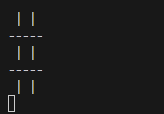

# Jogo da Velha com Programação Concorrente

<!--  -->

<div align="center">
  
</div>

## Descrição do Projeto

Neste trabalho prático, você irá resolver o problema de programação concorrente em um jogo da velha (Tic Tac Toe) com dois jogadores controlados pelo computador utilizando programação concorrente em C++.

O objetivo é praticar o uso de diretivas de sincronização para gerenciar o acesso ao tabuleiro e a alternância de turnos entre os jogadores.

A implementação envolve dois componentes principais:
1. **Tabuleiro do Jogo:** onde as jogadas são realizadas.
2. **Jogadores Concorrentes:** dois jogadores, cada um com sua estratégia de jogo já implementada, irão jogar de maneira concorrente.

## Requisitos

- Utilizar diretivas de sincronização para garantir o acesso exclusivo ao tabuleiro durante a execução das jogadas e coordenar a alternância de turnos entre os dois jogadores. Você deve decidir quais diretivas usar para garantir o bom funcionamento do código!

## Pseudo Código da Solução

### Estrutura Geral do Código

```pseudo
Classe TicTacToe:
    - Atributos:
        - board: matriz 3x3 de caracteres
        - current_player: caractere indicando o jogador atual ('X' ou 'O')
        - game_over: booleano indicando se o jogo acabou
        - winner: caractere indicando o vencedor ('X', 'O', ou 'D' para empate)

    - Métodos:
        - display_board(): exibe o estado atual do tabuleiro
        - make_move(jogador, linha, coluna): realiza uma jogada, verificando se é válida e atualizando o estado do jogo
        - check_win(jogador): verifica se o jogador atual ganhou o jogo
        - check_draw(): verifica se houve empate
        - is_game_over(): retorna se o jogo terminou
        - get_winner(): retorna o vencedor do jogo

Classe Player:
    - Atributos:
        - game: referência para o objeto TicTacToe
        - symbol: símbolo do jogador ('X' ou 'O')
        - strategy: estratégia do jogador ('sequencial' ou 'aleatório')

    - Métodos:
        - play(): executa as jogadas do jogador de acordo com a estratégia escolhida
        - play_sequential(): realiza jogadas de maneira sequencial no tabuleiro
        - play_random(): realiza jogadas aleatórias no tabuleir


Main:
    - Cria objeto TicTacToe
    - Cria dois objetos Player, um para cada jogador (X e O)
    - Iniciar duas threads, uma para cada jogador
    - Aguardar o término das threads
    - Exibir o resultado final do jogo
```

## Regras do Jogo (como deveria funcionar)

1. O jogo é executado em um tabuleiro 3x3, e os jogadores alternarão entre 'X' e 'O'.
2. Cada jogador fará uma jogada por vez, esperando sua vez.
3. Apenas um jogador possa acessar o tabuleiro de cada vez.
4. O jogo termina quando um jogador faz uma linha de três símbolos consecutivos (horizontal, vertical ou diagonal) ou quando todas as posições do tabuleiro estiverem preenchidas (empate).

## Estratégias de Jogadores (já implementado)

- **Jogador Sequencial:** faz uma jogada em cada posição sequencial do tabuleiro, começando da primeira até a última, até encontrar uma posição livre.
- **Jogador Aleatório:** faz uma jogada em uma posição aleatória do tabuleiro até encontrar uma posição livre.

## Instruções de Uso

1. Clone este repositório e compile o código usando um compilador C++ compatível (ex.: `g++`), de preferência usando `cmake` ou similar.
2. Execute o programa. Duas threads serão iniciadas, uma para cada jogador.
3. Observe a execução do jogo no console. O tabuleiro será exibido a cada jogada, e o resultado final será mostrado após o término do jogo.
4. Verifique os erros que ocorrem na execução (veja um exemplo abaixo) e corrija-o usando diretivas de sincronização.

<div align="center">
  
</div>

## Crédito

Este exercício foi adaptado a partir do trabalho elaborado pelo professor André Paim Lemos.

